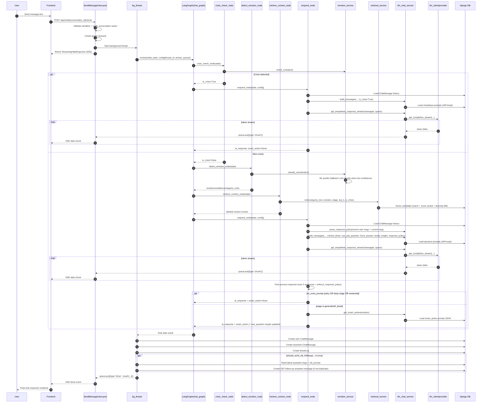

# Exhale Chatbot: End-to-End Backend Flow

## 1) Entry points (URLs)

Project-level routing:
- `backend/exhale/urls.py`
  - `path("api/chat/", include("chat.urls"))`
  - `path("api/knowledge/", include("knowledge.urls"))`

Chat app routes:
- `backend/chat/urls.py`
  - `GET/POST /api/chat/conversations/` -> `ConversationListCreateView`
  - `PATCH/DELETE /api/chat/conversations/<conversation_id>/` -> `ConversationDetailView`
  - `POST /api/chat/<conversation_id>/send/` -> `SendMessageView`
  - `GET /api/chat/<conversation_id>/history/` -> `ChatHistoryView`
  - `DELETE /api/chat/<conversation_id>/clear/` -> `ClearChatView`

Knowledge route used for direct retrieval testing:
- `POST /api/knowledge/search/` -> `KnowledgeSearchView`
  - payload now supports: `query`, `emotion`, `stage`, `is_crisis`

Main chatbot runtime starts at:
- `SendMessageView.post()` in `backend/chat/views.py`

---

## 2) Main runtime flow (`SendMessageView.post`)

When a user sends a chat message:

1. `SendMessageSerializer` validates request body (`content`, min 1, max 2000).
2. Conversation ownership is verified (`Conversation.objects.get(id=conversation_id, user=request.user)`).
3. A `queue.Queue()` is created for streaming tokens/events.
4. A background thread (`bg_thread`) is started.
5. Inside `bg_thread`, `chat_graph.invoke(...)` is called with:
   - input state (`text`, `emotion`, `stage`, `is_crisis`, `context`, personalization fields, etc.)
   - config: `thread_id = conversation.id`, `stream_queue = q`
6. While the graph runs, response tokens are pushed into queue as `{"type":"chunk","content":"..."}`.
7. Main request thread returns `StreamingHttpResponse` (`text/event-stream`) and yields queue items continuously.
8. After graph completion, backend writes DB rows (`ChatMessage`, `MoodLog`, optional CBT assistant message) and queues final `{"type":"done","result":...}`.
9. On failures, it queues `{"type":"error","error":"..."}`.

---

## 3) Graph construction and execution order

Graph definition file:
- `backend/chat/graph/__init__.py`

Compiled graph:
- `chat_graph = builder.compile(checkpointer=PostgresSaver(...))`

Nodes:
1. `crisis_check`
2. `detect_emotion`
3. `retrieve_context`
4. `respond`

Entry node:
- `crisis_check`

Conditional edges:
- `route_after_crisis(state)` in `backend/chat/graph/edges.py`
  - if `state["is_crisis"]` -> `respond`
  - else -> `detect_emotion`
- `route_after_detection(state)` always -> `retrieve_context`

Final edge:
- `respond -> END`

Because `invoke()` passes `thread_id`, LangGraph checkpointing stores and reloads per-conversation state history via Postgres saver.

---

## 4) State object (`ChatState`)

Defined in `backend/chat/graph/state.py`.

Fields used by runtime:
- input/context: `text`, `conversation_id`, `user_id`, `user_nickname`, `user_age`, `user_topics`
- emotion path: `emotion`, `confidence`, `is_crisis`
- stage path: `stage` (`general`, `self_doubt`, `burnout`, `hopelessness`)
- retrieval path: `context`
- response path: `ai_response`, `smart_action`
- question-control path: `last_question`
- policy path: `response_policy` (`no_question`, `no_extra_prompt`, `max_sentences`)

Question control logic:
- `should_ask_question(state)` in `nodes.py` is now stricter:
  - returns `False` for deep stages: `burnout`, `hopelessness`
  - returns `False` for existential prompts (for example: `"what's the point"`, `"why try"`, `"why bother"`)
  - otherwise returns `True` only when `last_question` is `None`
- after generating assistant text, `_extract_last_question()` stores last `?` sentence into `state["last_question"]`.

Why this change matters:
- In deep emotional states, we avoid ending with probing questions that can feel burdensome.
- For existential user questions, the assistant is expected to answer directly first, not pivot to a follow-up.

---

## 5) Node-by-node function call flow

### A) `crisis_check_node(state)`
File: `backend/chat/graph/nodes.py`

Calls:
- `check_crisis(state["text"])` from `emotion.services.emotion_service`

Behavior:
- if crisis keyword found:
  - sets `is_crisis=True`, `emotion="sad"`, `confidence=1.0`
  - graph routes directly to `respond`
- otherwise:
  - graph continues to emotion detection

### B) `detect_emotion_node(state)`
File: `backend/chat/graph/nodes.py`

Calls:
- `classify_emotion(state["text"])`

Inside `classify_emotion()` (`backend/emotion/services/emotion_service.py`):
1. Runs `check_crisis(text)` again.
2. If crisis:
   - tries `_llm_crisis_response(text)` using `get_completion(...)`
   - returns crisis dict (with message fallback if LLM fails).
3. If not crisis:
   - tries ML model `predict(text)` from `backend/emotion/ml/predict.py`
   - if confidence < `0.70`, falls back to `_llm_classify(text)` (LLM one-label classifier)
   - returns emotion payload.

State update in node:
- `state["emotion"] = result["emotion"]`
- `state["confidence"] = result.get("confidence", result.get("emotion_confidence", 1.0))`
- `state["is_crisis"] = result.get("is_crisis", False)`
- model stage and heuristic stage are both computed, then arbitrated:
  - `model_stage = result.get("stage")`
  - `heuristic_stage = _detect_stage(state["text"], state["emotion"])`
  - if heuristic is deep (`burnout`/`hopelessness`) and model stage is shallow/missing, heuristic wins.

Stage detection behavior:
- Uses explicit stage from classifier if present.
- Otherwise uses keyword heuristics (`burnout`, `hopelessness`, `self_doubt`), now including stronger existential variants for hopelessness detection such as:
  - `"what is the point"`
  - `"why try"`
  - `"why bother"`
- Burnout heuristics also include natural phrases seen in real chats, such as:
  - `"mentally tired"`
  - `"hard to focus"`
  - `"small tasks feel heavy"`
  - `"even small tasks"`
- Falls back to `"general"`.

### C) `retrieve_context_node(state)`
File: `backend/chat/graph/nodes.py`

Calls:
- `retrieve(query_text, emotion, stage, top_k=3, is_crisis=...)` from `knowledge.services.retrieval`

Inside `retrieve()` (`backend/knowledge/services/retrieval.py`):
1. Lazy-loads sentence-transformer model (`all-MiniLM-L6-v2`) once.
2. Embeds user query text.
3. Resolves stage:
   - uses passed stage if not `general`
   - otherwise infers stage from query keywords.
4. DB vector search:
   - crisis path: only `category="crisis_resource"`
   - normal path: excludes crisis resources and gets top semantic candidates (candidate pool).
5. Candidate reranking score:
   - `semantic_similarity`
   - `+ emotion bonus` (exact / related / untagged)
   - `+ stage bonus` (keyword and stage-category boost)
6. Diversity filter:
   - skips near-duplicate chunks using embedding cosine similarity threshold.
7. Labels final context lines (for example `Insight: ...`, `Question: ...`, `Reframe: ...`).
8. Returns top-k labeled chunks.

Result:
- `state["context"] = [retrieved chunk strings...]`

### D) `respond_node(state, config)`
File: `backend/chat/graph/nodes.py`

Calls:
1. Loads chat history from `ChatMessage` for the same `conversation_id`.
2. Builds per-turn `response_policy` from recent user messages + current message using `parse_response_policy(...)`.
3. Computes `can_ask_question = should_ask_question(state)` and then applies policy override:
   - if `response_policy["no_question"]` is true, questions are disabled.
4. Computes:
   - `force_answer = is_existential_question(state["text"])`
   - `needs_insight = stage in {"hopelessness", "burnout", "self_doubt"}`
5. Builds LLM messages via `build_messages(..., can_ask_question, force_answer, needs_insight, response_policy)`.
6. If `stream_queue` exists in config:
   - `get_empathetic_response_stream(messages, stream_queue)`
   - pushes token chunks to queue
   - also returns full concatenated response
7. Else:
   - `get_empathetic_response(messages)`
8. Post-processes response:
   - `_limit_response_sentences(...)` hard-caps to first 4 sentences
   - `enforce_response_policy(...)` applies user policy (for example remove `?`, cap sentence count)
9. If non-crisis:
   - if `response_policy["no_extra_prompt"]`: `state["smart_action"] = None`
   - else if stage is `burnout` or `hopelessness`: `state["smart_action"] = None`
   - else if `force_answer` is true (existential/deep direct question): `state["smart_action"] = None`
   - else: `state["smart_action"] = get_smart_action(state["emotion"])`
10. If `can_ask_question`:
   - extracts and stores `state["last_question"]`

Crisis fallback inside node:
- if crisis generation raises exception:
  - reads `AIPrompt(name="crisis_fallback")`
  - falls back to static emergency text if missing

---

## 6) Prompt and LLM message assembly (`build_messages`)

File:
- `backend/chat/services/llm_chat_service.py`

How prompts are composed:
1. Crisis mode:
   - uses `AIPrompt(name="crisis_system_prompt")` (fallback: hardcoded text).
2. Normal mode:
   - base: `AIPrompt(name="base_system_prompt")`
   - emotion modifier: `AIPrompt(name="emotion_prompt", emotion=<emotion>)`
   - stage modifier: `AIPrompt(name="stage_prompt", emotion=<stage>)`
   - anti-repetition: `AIPrompt(name="anti_repetition_prompt")`
3. Appends personalization text (nickname, age bracket, topics).
4. Formats retrieval into structured `CONTEXT BLOCK`:
   - bullet list
   - recognized labels: `Insight`, `Technique`, `Perspective`, `Question`, `Validation`, `Reframe`, `Resource`
   - unlabeled lines are defaulted to `Insight: ...`
5. Adds system message.
6. Question and existential controls:
   - if `?` exists or `force_answer=True` (and not crisis), adds `question_handling_prompt`
   - if `force_answer=True` (or existential pattern detected), appends hard instruction:
     - answer directly and clearly in 1-2 sentences first
     - do not avoid or soften the core question
7. Policy control (`response_policy`):
   - if `no_question`, injects explicit "Do NOT ask any question"
   - if `max_sentences`, injects explicit sentence cap
   - if `no_extra_prompt`, blocks add-on helper style output
8. Appends recent history (`history_limit=6`).
9. Appends current user message.
10. Question control:
   - if `can_ask_question=True`: appends `question_variety_prompt`
   - else: appends explicit instruction to not ask a follow-up question.
11. Insight requirement rule:
   - if `needs_insight=True` OR stage is insight-required (`burnout`, `hopelessness`, `self_doubt`) OR text indicates numbness
     (for example: `"numb"`, `"can't feel anything"`, `"empty inside"`, `"disconnected"`),
     adds an explicit instruction requiring at least one meaningful psychological insight (not validation-only).

---

## 12) Critical response guardrails (new)

These guardrails are now enforced in runtime message assembly and response flow, not just in seed prompts.

1. Existential/direct-question rule:
   - If user asks a direct existential question (example: `"What's the point of trying if it always comes back?"`), assistant must answer that question first.
   - Response should not avoid the question with generic reassurance only.

2. Deep-stage action suppression:
   - For `burnout` and `hopelessness`, `smart_action` is intentionally disabled (`None`).
   - For existential/deep direct questions, `smart_action` is also suppressed.
   - Rationale: task-style suggestions can feel invalidating during emotionally depleted states.

3. Insight requirement:
   - For numbness/burnout/hopelessness/self-doubt signals, reply must include at least one meaningful psychological insight (not only validation).
   - Example insight pattern: explain the emotional mechanism (for example emotional shutdown after prolonged overload), then connect it to a realistic path forward.

4. Response-length control:
   - After generation, response is trimmed to a max of ~4 sentences.
   - This provides a final enforcement layer against long or rambling output.

5. Persistent constraint policy:
   - `parse_response_policy(...)` reads directives from recent user turns.
   - Latest directive wins (users can naturally override earlier constraints).
   - Enforced flags:
     - `no_question`
     - `no_extra_prompt`
     - `max_sentences`
   - Effects:
     - questions can be suppressed across follow-ups
     - helpful/extra prompts are suppressed across follow-ups
     - sentence limits can be applied consistently

---

## 7) LLM client call path

Service wrapper:
- `backend/services/llm_client.py`

Startup:
- `_build_client()` reads:
  - `LLM_PROVIDER` (`openrouter`/`llmapi`/`gemini`/`groq`)
  - provider-specific API key env var
  - `LLM_MODEL`
- creates OpenAI-compatible client with provider base URL.

Runtime functions:
- `get_completion(messages, max_tokens, temperature)` -> non-stream text
- `get_completion_stream(...)` -> yields token deltas

Chat service wrappers:
- `get_empathetic_response(...)` wraps exceptions as `LLMAPIError`
- `get_empathetic_response_stream(...)` emits queue chunks and wraps exceptions as `LLMAPIError`

---

## 8) Persistence after graph completion

Back in `SendMessageView.bg_thread()` after `chat_graph.invoke(...)` returns:

1. Creates user `ChatMessage` row (stores emotion + confidence on user message).
2. Creates assistant `ChatMessage` row (`result["ai_response"]`).
3. Creates `MoodLog` row (`source="chat"`).
4. Optional CBT follow-up:
   - uses `should_send_cbt_followup(...)`
   - blocked when:
     - crisis
     - emotion not in `("sad", "anxious")`
     - deep stage (`burnout`, `hopelessness`)
     - existential user text
     - `response_policy.no_extra_prompt=True`
   - still avoids duplicates in last 3 assistant messages
5. Sends SSE final payload:
   - `user_message`
   - `ai_message`
   - `smart_action`
   - `is_crisis`
   - optional `cbt_prompt`

---

## 9) Error handling path

Inside background thread:
- `LLMAPIError` -> queue error `"AI service temporarily unavailable."`
- any other exception -> queue error `"Something went wrong. Please try again."`

Outside thread in `post()`:
- serializer/ownership/errors return normal HTTP error responses (`400`, `404`, `500`, `503`).

---

## 10) Knowledge base schema + seeding updates

### A) Knowledge categories expanded
File: `backend/knowledge/models.py`

`KnowledgeChunk.category` now includes both legacy and newer reasoning-pattern categories:
- Legacy: `cbt_technique`, `breathing_grounding`, `reflection_question`, `psychoeducation`, `crisis_resource`
- New: `insight`, `reframe`, `validation`, `perspective`, `question`, `technique`

Migration:
- `backend/knowledge/migrations/0003_alter_knowledgechunk_category.py`

### B) Seeding behavior updated
File: `backend/knowledge/management/commands/seed_knowledge.py`

`seed_knowledge` now:
- seeds a more diverse corpus (insights/reframes/validations/questions/techniques + crisis resources)
- uses `update_or_create` keyed by `content` (idempotent sync behavior)
- updates embeddings for existing matching chunks instead of skipping when rows exist

### C) Retrieval API serializer update
Files:
- `backend/knowledge/serializers.py`
- `backend/knowledge/views.py`

`KnowledgeSearchSerializer` now accepts:
- `stage` in `["general", "self_doubt", "burnout", "hopelessness"]`

The view forwards `stage` to retrieval:
- `retrieve(query_text, emotion, stage, is_crisis)`

---

## 11) Sequence diagram (full chat flow)

